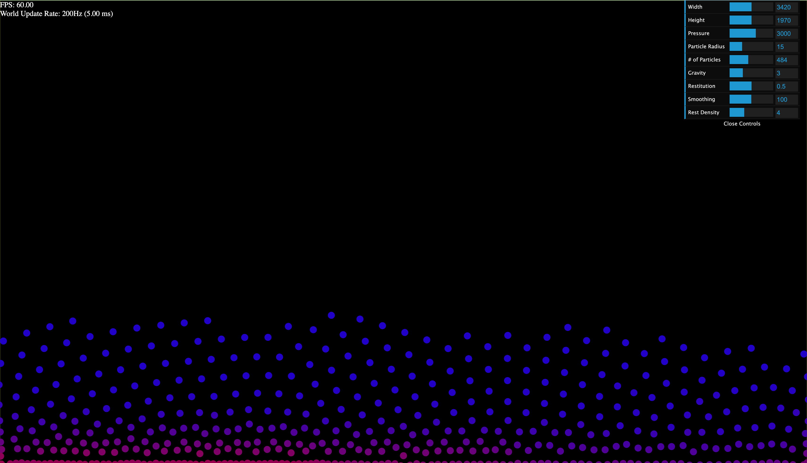

# fluid-forma

i made a fluid/jelly simulator in roughly 4 hours based off my phone timer. it's not that accurate (particles aren't uniform, only pressure/gravity forces, rough surface), but it looks cool i guess.

## controls

left click to attract particles (does not work well), right click to repel particles.

## media

